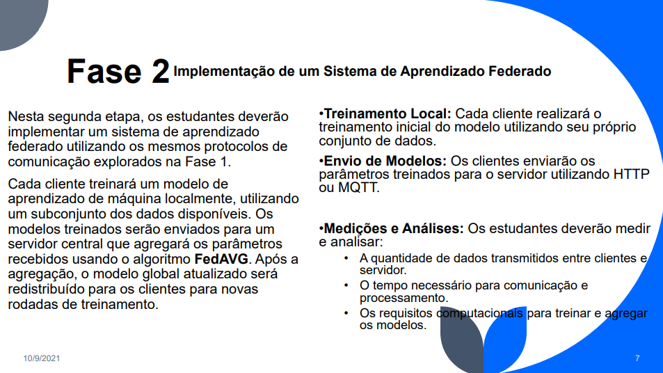
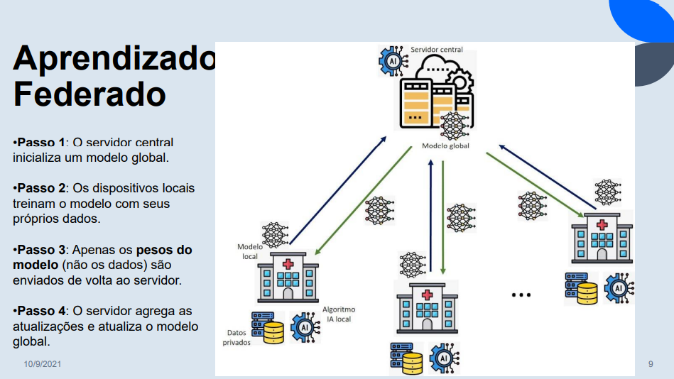
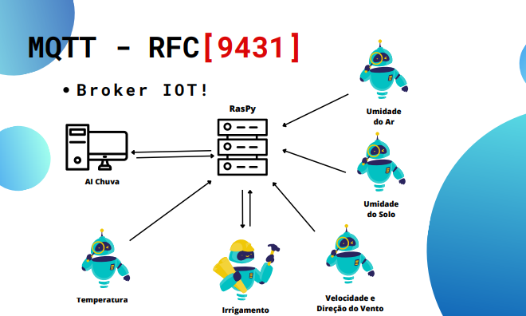
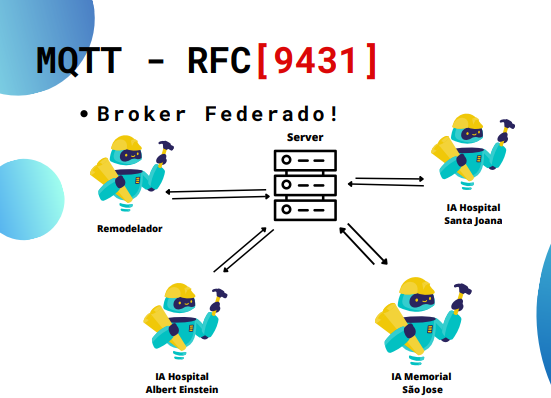

# Projeto de Redes 1 - 2EE
Alunos
- Alysson
- Pedro Bulle
- Ruan de Melo
- Vinícius Ribeiro

# Explicação do Repo - __-Side
<!--colocar o side (client|server) e explicar  o resto-->


<!--


-->
# 2EE
## Critérios adotados

- Os dados do CIFAM10 vão ser divididos, para manter a segurança

- o foco vai ser em redes e não em IA,
    - para IA o suficiente, para Redes, o Máximo.

### Foco em Redes: 
1. colocar os ratin de transferenia, etc..

---
## Explicação do Projeto





## Explicação do MQTT




## Cód. Base (Fornecido Pelo Estag. Docente)

### Client
```python
import torch
from torchvision.datasets import CIFAR10
from torch.utils.data import DataLoader, random_split
import torchvision.transforms as transforms
import sys
import os
import pickle

class FederatedNet(torch.nn.Module):
    def __init__(self):
        # Define the CNN architecture with convolutional, pooling, and fully connected layers 
        super().__init__()
        self.conv1 = torch.nn.Conv2d(3, 20, 7)
        self.conv2 = torch.nn.Conv2d(20, 40, 7)
        self.maxpool = torch.nn.MaxPool2d(2, 2)
        self.flatten = torch.nn.Flatten()
        self.linear = torch.nn.Linear(2560, 10)
        self.non_linearity = torch.nn.functional.relu
        # Track layers for easy parameter extraction and update
        self.track_layers = {'conv1': self.conv1, 'conv2': self.conv2, 'linear': self.linear}

    def forward(self, x):
        x = self.non_linearity(self.conv1(x))
        x = self.non_linearity(self.conv2(x))
        x = self.maxpool(x)
        x = self.flatten(x)
        x = self.linear(x)
        return x

    def get_parameters(self):
        #Extract model parameters as a dictionary of weights and biases
        return {name: {'weight': layer.weight.data.clone(), 'bias': layer.bias.data.clone()} for name, layer in self.track_layers.items()}

    def apply_parameters(self, parameters):
        # Update model parameters using a dictionary of weights and biases
        with torch.no_grad():
            for name in parameters:
                self.track_layers[name].weight.data.copy_(parameters[name]['weight'])
                self.track_layers[name].bias.data.copy_(parameters[name]['bias'])


class Client:
    def __init__(self, client_id):
        self.client_id = client_id
        self.dataset = self.load_data()

    def load_data(self):
        #Load and partition CIFAR-10 dataset for the client
        transform = transforms.Compose([transforms.ToTensor()])
        full_dataset = CIFAR10(root='./data', train=True, download=True, transform=transform)
        examples_per_client = len(full_dataset) // 3
        start_idx = self.client_id * examples_per_client
        end_idx = start_idx + examples_per_client
        return full_dataset[start_idx:end_idx]

    def train(self, parameters):
        #Train the model on the client's local dataset
        net = FederatedNet()
        net.apply_parameters(parameters)
        optimizer = torch.optim.SGD(net.parameters(), lr=0.02)
        dataloader = DataLoader(self.dataset, batch_size=128, shuffle=True)

        for epoch in range(3):
            for inputs, labels in dataloader:
                optimizer.zero_grad()
                outputs = net(inputs)
                loss = torch.nn.functional.cross_entropy(outputs, labels)
                loss.backward()
                optimizer.step()

        return net.get_parameters()


if __name__ == "__main__":
    # Expecting client_id and parameters path
    if len(sys.argv) != 3:
        print("Usage: python client.py <client_id> <parameters_path>")
        sys.exit(1)

    client_id = int(sys.argv[1])
    parameters_path = sys.argv[2]

    # Load parameters
    if os.path.exists(parameters_path):
        with open(parameters_path, 'rb') as f:
            parameters = pickle.load(f)
    else:
        parameters = None

    client = Client(client_id)
    updated_parameters = client.train(parameters)

    # Save updated parameters
    output_path = f"client_{client_id}_parameters.pkl"
    with open(output_path, 'wb') as f:
        pickle.dump(updated_parameters, f)

    print(f"Client {client_id} training completed. Updated parameters saved to {output_path}")
```

### Server
```python
import torch
import pickle
import os

class FederatedNet(torch.nn.Module):
    def __init__(self):
        super().__init__()
        self.conv1 = torch.nn.Conv2d(3, 20, 7)
        self.conv2 = torch.nn.Conv2d(20, 40, 7)
        self.maxpool = torch.nn.MaxPool2d(2, 2)
        self.flatten = torch.nn.Flatten()
        self.linear = torch.nn.Linear(2560, 10)
        self.non_linearity = torch.nn.functional.relu
        self.track_layers = {'conv1': self.conv1, 'conv2': self.conv2, 'linear': self.linear}

    def forward(self, x):
        x = self.non_linearity(self.conv1(x))
        x = self.non_linearity(self.conv2(x))
        x = self.maxpool(x)
        x = self.flatten(x)
        x = self.linear(x)
        return x

    def get_parameters(self):
        return {name: {'weight': layer.weight.data.clone(), 'bias': layer.bias.data.clone()} for name, layer in self.track_layers.items()}

    def apply_parameters(self, parameters):
        with torch.no_grad():
            for name in parameters:
                self.track_layers[name].weight.data.copy_(parameters[name]['weight'])
                self.track_layers[name].bias.data.copy_(parameters[name]['bias'])


if __name__ == "__main__":
    # Number of communication rounds and clients
    rounds = 30
    num_clients = 3

    # Initialize the global model and get its parameters
    global_net = FederatedNet()
    global_parameters = global_net.get_parameters()

    # Federated training loop
    for round_num in range(rounds):
        print(f"Starting round {round_num + 1}")

        # Create a parameter accumulator to aggregate client updates
        new_parameters = {name: {'weight': torch.zeros_like(param['weight']), 'bias': torch.zeros_like(param['bias'])} for name, param in global_parameters.items()}

        # Iterate over each client
        for client_id in range(num_clients):
            parameters_path = f"client_{client_id}_parameters.pkl"
            
            # Check if the client has provided its parameters
            if os.path.exists(parameters_path):
                with open(parameters_path, 'rb') as f:
                    client_parameters = pickle.load(f)

                # Accumulate parameters from the client
                for name in client_parameters:
                    new_parameters[name]['weight'] += client_parameters[name]['weight'] / num_clients
                    new_parameters[name]['bias'] += client_parameters[name]['bias'] / num_clients
            else:
                print(f"Warning: {parameters_path} not found. Skipping client {client_id}")

        # Update global model with averaged parameters
        global_net.apply_parameters(new_parameters)
        global_parameters = new_parameters

        print(f"Round {round_num + 1} completed")

    # Save the final global model parameters
    with open("global_parameters.pkl", 'wb') as f:
        pickle.dump(global_parameters, f)

    print("Global training completed. Parameters saved to global_parameters.pkl")
```